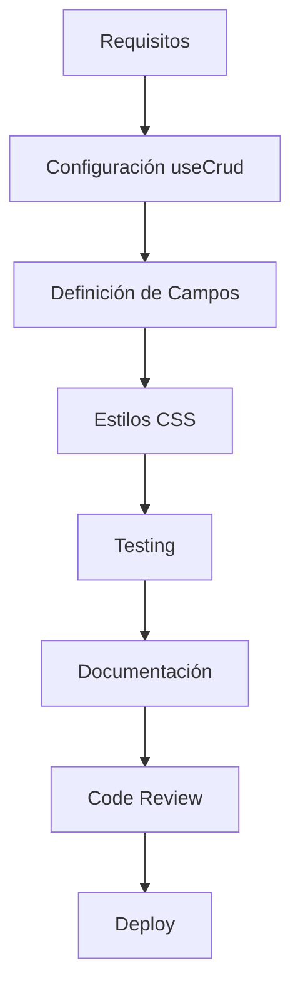

# 📖 Manual Técnico para Desarrolladores y QA - Condaty Admin

## 🎯 Bienvenido al Equipo Condaty

Este manual es tu guía completa para entender, desarrollar y mantener el sistema Condaty Admin - una plataforma integral de administración condominial construida con Next.js y React.

---

## 📋 Índice

1. [Visión General del Proyecto](#-visión-general-del-proyecto)
2. [Configuración del Entorno](#-configuración-del-entorno)
3. [Arquitectura del Sistema](#-arquitectura-del-sistema)
4. [Librería MK - Framework Core](#-librería-mk---framework-core)
5. [Desarrollo de Módulos](#-desarrollo-de-módulos)
6. [Estándares de Código](#-estándares-de-código)
7. [Testing y QA](#-testing-y-qa)
8. [Flujos de Trabajo](#-flujos-de-trabajo)
9. [Resolución de Problemas](#-resolución-de-problemas)
10. [Recursos y Referencias](#-recursos-y-referencias)

---

## 🏗️ Visión General del Proyecto

### ¿Qué es Condaty Admin?

**Condaty Admin** es una aplicación web de administración condominial que gestiona:
- 🔐 Control de accesos y seguridad
- 💰 Administración financiera y pagos
- 📅 Reservas de áreas comunes
- 🚨 Sistema de alertas y notificaciones
- 👥 Gestión de residentes y propietarios
- 📊 Reportes y analytics

### Stack Tecnológico

```
Frontend:
├── Next.js 15.2.4 (App Router)
├── React 19.1.0
├── TypeScript 5.x (estricto)
├── CSS Modules + Variables CSS
└── Turbopack (desarrollo)

Backend:
├── Laravel API (PHP)
├── JWT Authentication
└── MySQL Database

Servicios Externos:
├── Pusher (real-time notifications)
├── InstantDB (chat & persistent notifications)
├── Cloudinary (image storage)
└── ApexCharts (data visualization)
```

### Estructura del Proyecto

```
src/
├── app/                    # Next.js App Router (páginas)
├── components/            # Componentes específicos del proyecto
├── contexts/              # Context providers específicos
├── modulos/               # Módulos de negocio (24 módulos)
└── mk/                    # LIBRERÍA MK - Framework reutilizable
    ├── components/        # Componentes UI reutilizables
    ├── hooks/             # Custom hooks
    ├── contexts/          # Auth & Axios providers
    ├── utils/             # Utilidades
    └── types/             # Definiciones TypeScript
```

---

## ⚙️ Configuración del Entorno

### Requisitos Previos

```bash
# Node.js (v18 o superior)
node --version

# npm o pnpm
npm --version
# o
pnpm --version
```

### Instalación Inicial

```bash
# 1. Clonar el repositorio
git clone [URL_DEL_REPOSITORIO]
cd condaty-admin

# 2. Instalar dependencias
npm install
# o si usas pnpm
pnpm install

# 3. Configurar variables de entorno
cp example.env.development .env.development
# Editar .env.development con tus credenciales
```

### Variables de Entorno Necesarias

```env
# Backend API
NEXT_PUBLIC_API_URL=https://phplaravel-1214481-5270819.cloudwaysapps.com/api

# Pusher (Real-time)
NEXT_PUBLIC_PUSHER_KEY=tu_pusher_key
NEXT_PUBLIC_PUSHER_CLUSTER=us2

# InstantDB
NEXT_PUBLIC_INSTANTDB_APP_ID=tu_instantdb_app_id

# Cloudinary
NEXT_PUBLIC_CLOUDINARY_CLOUD_NAME=tu_cloudinary_name
```

### Scripts de Desarrollo

```bash
# Desarrollo con Turbopack (rápido)
npm run dev

# Build para producción
npm run build

# Iniciar servidor de producción
npm run start

# Linting
npm run lint
```

### Verificación de Instalación

```bash
# Verificar que el servidor arranque
npm run dev
# Abrir http://localhost:3000

# Verificar build
npm run build
# Debe completarse sin errores
```

---

## 🏛️ Arquitectura del Sistema

### Principios de Arquitectura

1. **Modularidad**: Cada funcionalidad es un módulo independiente
2. **Reutilización**: Librería MK como framework core
3. **Configuración sobre Codificación**: Los módulos se configuran, no se programan
4. **TypeScript Estricto**: Seguridad de tipos en todo el código
5. **CSS Modules**: Estilos encapsulados por componente

### Flujo de Datos

```
Usuario → Componente React → useCrud Hook → Axios → Laravel API → Database
                    ↓
            Librería MK (UI, validación, estados)
```

### Sistema de Autenticación

```typescript
// Flujo JWT
1. Login → JWT Token → Almacenado en localStorage
2. Axios Interceptor → Agrega Bearer Token automáticamente
3. Refresh Token → Renovación automática
4. Logout → Limpieza de tokens y redirección
```

### Estructura de Módulos

Cada módulo sigue esta estructura:

```
Modulo/
├── Modulo.tsx           # Componente principal
├── Modulo.module.css    # Estilos
├── RenderForm.tsx       # Formulario CRUD
├── RenderView.tsx       # Vista detalle
├── [Submodulos]/        # Submódulos específicos
└── constants/           # Constantes y configuraciones
```

---

## 📚 Librería MK - Framework Core

### ¿Qué es la Librería MK?

La **Librería MK** es un framework completo y reutilizable que proporciona:
- ✅ Sistema CRUD automático
- ✅ Formularios dinámicos con validación
- ✅ Tablas con paginación y filtros
- ✅ Modales para crear/editar/ver/eliminar
- ✅ Importación/exportación de datos
- ✅ Sistema de permisos integrado
- ✅ Manejo de estados completo

### Hook useCrud - El Corazón del Sistema

```typescript
// Ubicación: src/mk/hooks/useCrud/useCrud.tsx (1646 líneas)

interface UseCrudType {
  // Operaciones CRUD
  onAdd: () => void;
  onEdit: (item: Record<string, any>) => void;
  onDel: (item: Record<string, any>) => void;
  onView: (item: Record<string, any>) => void;
  onSave: (data: Record<string, any>) => Promise<void>;

  // Datos y estados
  data: any[];
  loaded: boolean;
  reLoad: (params?: Record<string, any>) => void;

  // UI Estados
  open: boolean;           // Modal crear/editar
  openView: boolean;       // Modal ver
  openDel: boolean;        // Modal eliminar

  // Búsqueda y filtros
  onSearch: (searchTerm: string) => void;
  onFilter: (filterKey: string, filterValue: string) => void;

  // Paginación
  onChangePage: (page: number) => void;
  onChangePerPage: (perPage: number) => void;

  // Import/Export
  onImport: () => void;
  onExport: (type?: 'pdf' | 'xls' | 'csv') => void;

  // Componentes
  List: React.FC<any>;      // Tabla/lista automática
}
```

### Configuración de un Módulo

```typescript
// Ejemplo de configuración para el módulo Usuarios

const mod: ModCrudType = {
  // Requeridos
  modulo: 'users',                    // Endpoint API
  singular: 'Usuario',                // Nombre singular
  plural: 'Usuarios',                  // Nombre plural
  permiso: 'USER',                      // Código de permiso

  // Opcionales
  export: true,                         // Habilitar exportación
  import: true,                         // Habilitar importación
  filter: true,                         // Habilitar filtros
  search: true,                         // Habilitar búsqueda
  pagination: true,                     // Habilitar paginación
  listAndCard: true,                    // Vista lista/tarjetas

  // Personalización
  titleAdd: 'Crear Usuario',
  titleEdit: 'Editar Usuario',
  titleDel: 'Eliminar Usuario',
  titleView: 'Ver Usuario',

  // Mensajes personalizados
  saveMsg: {
    add: 'Usuario creado exitosamente',
    edit: 'Usuario actualizado exitosamente',
    del: 'Usuario eliminado exitosamente'
  },

  // Control de acciones
  hideActions: {
    add: false,     // Ocultar botón agregar
    edit: false,    // Ocultar botón editar
    del: false,     // Ocultar botón eliminar
    view: false     // Ocultar botón ver
  }
};
```

### Definición de Campos

```typescript
// Cada campo se configura con propiedades específicas

const fields: Record<string, FieldConfig> = {
  name: {
    label: 'Nombre Completo',
    
    // Configuración del formulario
    form: {
      type: 'text',
      rules: { 
        required: true, 
        minLength: 3,
        maxLength: 50 
      },
      order: 1,
      placeholder: 'Ingrese el nombre completo'
    },
    
    // Configuración de la tabla
    list: {
      order: 1,
      width: '200px',
      sortable: true
    },
    
    // Configuración de la vista
    view: {
      order: 1
    }
  },

  email: {
    label: 'Email',
    form: {
      type: 'email',
      rules: { 
        required: true,
        pattern: '^[\\w._%+-]+@[\\w.-]+\\.[A-Za-z]{2,}$'
      }
    },
    list: {
      order: 2,
      width: '250px'
    }
  },

  role: {
    label: 'Rol',
    form: {
      type: 'select',
      options: [
        { id: 'admin', name: 'Administrador' },
        { id: 'guard', name: 'Guardia' },
        { id: 'resident', name: 'Residente' }
      ],
      optionLabel: 'name',    // Campo a mostrar
      optionValue: 'id'       // Campo valor
    },
    list: {
      order: 3,
      width: '150px',
      onRender: (item) => (
        <span className={`badge-${item.value}`}>
          {item.value === 'admin' ? 'Admin' : 
           item.value === 'guard' ? 'Guardia' : 'Residente'}
        </span>
      )
    }
  },

  // Campo con datos externos
  department_id: {
    label: 'Departamento',
    form: {
      type: 'select',
      optionsExtra: 'departments',  // Carga desde extraData
      optionLabel: 'name',
      optionValue: 'id',
      rules: { required: true }
    }
  },

  // Campo de imagen
  avatar: {
    label: 'Avatar',
    form: {
      type: 'image',
      accept: 'image/*',
      maxSize: 2 * 1024 * 1024,  // 2MB
      aspectRatio: '1:1'
    },
    list: {
      order: 0,
      width: '60px',
      onRender: (item) => (
        
      )
    }
  },

  // Campo booleano
  is_active: {
    label: 'Estado',
    form: {
      type: 'switch',
      defaultValue: true
    },
    list: {
      order: 4,
      width: '100px',
      onRender: (item) => (
        <StatusBadge 
          status={item.value ? 'active' : 'inactive'}
          text={item.value ? 'Activo' : 'Inactivo'}
        />
      )
    }
  }
};
```

### Tipos de Campos Soportados

```typescript
// Todos los tipos de campos disponibles

const fieldTypes = {
  text: 'Campo de texto simple',
  email: 'Campo de email con validación',
  number: 'Campo numérico',
  tel: 'Campo telefónico',
  password: 'Campo de contraseña',
  textarea: 'Área de texto largo',
  select: 'Selector de opciones',
  multiselect: 'Selector múltiple',
  checkbox: 'Checkbox individual',
  switch: 'Switch on/off',
  radio: 'Radio buttons',
  date: 'Selector de fecha',
  datetime: 'Fecha y hora',
  time: 'Hora',
  file: 'Archivo individual',
  image: 'Imagen con preview',
  color: 'Selector de color',
  url: 'Campo URL',
  range: 'Slider numérico',
  hidden: 'Campo oculto'
};
```

### Uso del Hook useCrud

```typescript
// Ejemplo completo de uso en un componente

import { useCrud } from '@/mk/hooks/useCrud/useCrud';
import { ModCrudType, FieldConfig } from '@/mk/hooks/useCrud/useCrud';

export default function UsersModule() {
  // 1. Configurar el módulo
  const mod: ModCrudType = {
    modulo: 'users',
    singular: 'Usuario',
    plural: 'Usuarios',
    permiso: 'USER',
    export: true,
    import: true,
    filter: true,
    search: true,
    pagination: true
  };

  // 2. Definir los campos
  const fields: Record<string, FieldConfig> = {
    name: { /* ... configuración ... */ },
    email: { /* ... configuración ... */ },
    role: { /* ... configuración ... */ }
  };

  // 3. Inicializar el hook
  const {
    List,           // Componente tabla/lista automática
    onAdd,          // Función para agregar
    onEdit,         // Función para editar
    onDel,          // Función para eliminar
    onView,         // Función para ver
    data,           // Datos cargados
    loaded,         // Estado de carga
    open,           // Estado del modal
    // ... más propiedades
  } = useCrud({
    paramsInitial: { page: 1, perPage: 10 },
    mod,
    fields
  });

  // 4. Renderizar
  return (
    <div className="users-module">
      <div className="module-header">
        <h1>Gestión de Usuarios</h1>
        <button onClick={onAdd} className="btn-primary">
          Agregar Usuario
        </button>
      </div>
      
      {/* Tabla/lista automática con todo incluido */}
      <List />
    </div>
  );
}
```

---

## 🔧 Desarrollo de Módulos

### Crear un Nuevo Módulo

```bash
# 1. Crear estructura del módulo
mkdir src/modulos/MiModulo
cd src/modulos/MiModulo

# 2. Crear archivos base
touch MiModulo.tsx MiModulo.module.css RenderForm.tsx RenderView.tsx
```

### Plantilla de Módulo Básico

```typescript
// src/modulos/MiModulo/MiModulo.tsx

import { useCrud } from '@/mk/hooks/useCrud/useCrud';
import { ModCrudType, FieldConfig } from '@/mk/hooks/useCrud/useCrud';
import styles from './MiModulo.module.css';

export default function MiModulo() {
  // Configuración del módulo
  const mod: ModCrudType = {
    modulo: 'mi_modulo',
    singular: 'Elemento',
    plural: 'Elementos',
    permiso: 'MI_MODULO',
    export: true,
    import: true,
    filter: true,
    search: true,
    pagination: true
  };

  // Definición de campos
  const fields: Record<string, FieldConfig> = {
    name: {
      label: 'Nombre',
      form: {
        type: 'text',
        rules: { required: true, minLength: 3 }
      },
      list: {
        order: 1,
        width: '200px',
        sortable: true
      }
    },
    description: {
      label: 'Descripción',
      form: {
        type: 'textarea',
        rules: { maxLength: 500 }
      },
      list: {
        order: 2,
        width: '300px'
      }
    },
    status: {
      label: 'Estado',
      form: {
        type: 'select',
        options: [
          { id: 'active', name: 'Activo' },
          { id: 'inactive', name: 'Inactivo' }
        ],
        optionLabel: 'name',
        optionValue: 'id',
        defaultValue: 'active'
      },
      list: {
        order: 3,
        width: '120px',
        onRender: (item) => (
          <span className={`badge-${item.value}`}>
            {item.value === 'active' ? 'Activo' : 'Inactivo'}
          </span>
        )
      }
    }
  };

  // Inicializar useCrud
  const { List, onAdd } = useCrud({
    paramsInitial: { page: 1, perPage: 10 },
    mod,
    fields
  });

  return (
    <div className={styles.moduleContainer}>
      <div className={styles.header}>
        <h1>Gestión de Mi Módulo</h1>
        <button onClick={onAdd} className="btn-primary">
          Agregar Elemento
        </button>
      </div>
      
      <List />
    </div>
  );
}
```

### Estilos del Módulo

```css
/* src/modulos/MiModulo/MiModulo.module.css */

.moduleContainer {
  padding: var(--spacing-unit);
  background-color: var(--background-color);
  color: var(--text-color);
  min-height: 100vh;
}

.header {
  display: flex;
  justify-content: space-between;
  align-items: center;
  margin-bottom: calc(var(--spacing-unit) * 3);
  padding-bottom: var(--spacing-unit);
  border-bottom: 1px solid var(--border-color);
}

.header h1 {
  font-size: 1.5rem;
  font-weight: 600;
  color: var(--primary-color);
}

/* Personalización de badges */
.badge-active {
  background-color: var(--success-color);
  color: white;
  padding: 0.25rem 0.5rem;
  border-radius: var(--border-radius);
  font-size: 0.875rem;
}

.badge-inactive {
  background-color: var(--danger-color);
  color: white;
  padding: 0.25rem 0.5rem;
  border-radius: var(--border-radius);
  font-size: 0.875rem;
}
```

### Agregar Ruta en Next.js

```typescript
// src/app/mi-modulo/page.tsx

import MiModulo from '@/modulos/MiModulo/MiModulo';

export default function MiModuloPage() {
  return <MiModulo />;
}
```

### Agregar al Menú Principal

```typescript
// src/components/MainMenu/mainMenuConfig.ts

export const menuItems = [
  // ... items existentes
  {
    id: 'mi-modulo',
    label: 'Mi Módulo',
    icon: 'icono-apropiado',
    path: '/mi-modulo',
    permission: 'MI_MODULO'  // Debe coincidir con mod.permiso
  }
];
```

---

## 📏 Estándares de Código

### Convenciones de Nomenclatura

```typescript
// Archivos y carpetas
ComponentesReact.tsx    # PascalCase para componentes
utilsFunctions.ts       # camelCase para utilidades
mi-modulo/              # kebab-case para carpetas
styles.module.css       # lowercase para estilos

// Variables y funciones
const userName = 'John';           # camelCase
const API_URL = 'https://...';     # UPPER_SNAKE_CASE para constantes
const isActive = true;             # booleanos con prefijo is/has/should

// Interfaces y tipos
interface UserProfile {            # PascalCase
  userId: number;                  # camelCase para propiedades
  isVerified: boolean;
}

type UserRole = 'admin' | 'user';  # PascalCase

// Componentes React
function UserCard({ userId, className }: UserCardProps) {
  return <div className={className}>...</div>;
}
```

### Estructura de Componentes

```typescript
// 1. Imports (orden específico)
import React from 'react';
import { useRouter } from 'next/navigation';

// Librerías externas
import axios from 'axios';
import { format } from 'date-fns';

// Componentes internos
import Button from '@/mk/components/forms/Button';
import { useCrud } from '@/mk/hooks/useCrud/useCrud';

// Tipos y utilidades
import { User } from '@/types/user';
import { formatCurrency } from '@/mk/utils/numbers';

// Estilos
import styles from './Component.module.css';

// 2. Interfaces/Types
interface ComponentProps {
  userId: number;
  className?: string;
  onUpdate?: (user: User) => void;
}

interface ComponentState {
  isLoading: boolean;
  error: string | null;
}

// 3. Componente principal
export default function UserManager({ userId, className, onUpdate }: ComponentProps) {
  // 4. Hooks
  const router = useRouter();
  const [state, setState] = React.useState<ComponentState>({
    isLoading: false,
    error: null
  });

  // 5. Efectos
  React.useEffect(() => {
    loadUserData();
  }, [userId]);

  // 6. Funciones
  const loadUserData = async () => {
    try {
      setState(prev => ({ ...prev, isLoading: true, error: null }));
      const response = await axios.get(`/api/users/${userId}`);
      // ... procesar datos
    } catch (error) {
      setState(prev => ({ ...prev, error: 'Error al cargar usuario' }));
    } finally {
      setState(prev => ({ ...prev, isLoading: false }));
    }
  };

  // 7. Render
  return (
    <div className={`${styles.container} ${className || ''}`}>
      {state.isLoading && <LoadingScreen />}
      {state.error && <ErrorMessage message={state.error} />}
      {/* Contenido principal */}
    </div>
  );
}
```

### CSS Modules - Mejores Prácticas

```css
/* Component.module.css */

/* 1. Usar variables CSS del tema */
.container {
  background-color: var(--background-color);
  color: var(--text-color);
  padding: var(--spacing-unit);
  border-radius: var(--border-radius);
}

/* 2. Nomenclatura BEM simplificada */
.card {
  /* Bloque principal */
}

.card__header {
  /* Elemento */
}

.card--active {
  /* Modificador */
}

/* 3. Evitar anidamiento profundo */
/* ❌ Mal */
.card .header .title .icon {
  /* Demasiado específico */
}

/* ✅ Bien */
.cardIcon {
  /* Clase directa */
}

/* 4. Mobile-first responsive */
.grid {
  /* Mobile: 1 columna */
  display: grid;
  grid-template-columns: 1fr;
  gap: var(--spacing-unit);
}

@media (min-width: 768px) {
  .grid {
    /* Tablet: 2 columnas */
    grid-template-columns: repeat(2, 1fr);
  }
}

@media (min-width: 1024px) {
  .grid {
    /* Desktop: 3 columnas */
    grid-template-columns: repeat(3, 1fr);
  }
}
```

### Manejo de Estados

```typescript
// ✅ Buen manejo de estados con useState

interface ComponentState {
  data: User[];
  loading: boolean;
  error: string | null;
  filters: {
    search: string;
    status: string;
    dateRange: [Date, Date] | null;
  };
}

const [state, setState] = useState<ComponentState>({
  data: [],
  loading: false,
  error: null,
  filters: {
    search: '',
    status: 'all',
    dateRange: null
  }
});

// Actualización de estado inmutable
const updateFilter = (key: string, value: any) => {
  setState(prev => ({
    ...prev,
    filters: {
      ...prev.filters,
      [key]: value
    }
  }));
};

// Reset de estado
const resetFilters = () => {
  setState(prev => ({
    ...prev,
    filters: {
      search: '',
      status: 'all',
      dateRange: null
    }
  }));
};
```

### Manejo de Errores

```typescript
// ✅ Manejo robusto de errores

async function fetchUserData(userId: number) {
  try {
    const response = await axios.get(`/api/users/${userId}`);
    
    if (!response.data) {
      throw new Error('No se recibieron datos del usuario');
    }
    
    return response.data;
    
  } catch (error) {
    // Manejo específico por tipo de error
    if (axios.isAxiosError(error)) {
      switch (error.response?.status) {
        case 404:
          throw new Error('Usuario no encontrado');
        case 401:
          throw new Error('No autorizado');
        case 500:
          throw new Error('Error del servidor');
        default:
          throw new Error('Error al cargar usuario');
      }
    }
    
    // Error desconocido
    console.error('Error inesperado:', error);
    throw new Error('Error inesperado al cargar datos');
  }
}
```

---

## 🧪 Testing y QA

### Estrategia de Testing

```
Nivel 1: Unit Tests (Componentes individuales)
├── Hooks personalizados
├── Funciones utilitarias
└── Componentes UI puros

Nivel 2: Integration Tests (Flujos completos)
├── Autenticación
├── CRUD operations
├── Form validation
└── API interactions

Nivel 3: E2E Tests (User journeys)
├── Login → Dashboard → Logout
├── Crear usuario → Editar → Eliminar
├── Reserva de área → Pago → Confirmación
└── Alerta → Atención → Cierre
```

### Herramientas de Testing

```bash
# Instalar dependencias de testing
npm install --save-dev @testing-library/react @testing-library/jest-dom vitest @vitejs/plugin-react

# Configurar Vitest (archivo vite.config.ts)
import { defineConfig } from 'vite';
import react from '@vitejs/plugin-react';

export default defineConfig({
  plugins: [react()],
  test: {
    globals: true,
    environment: 'jsdom',
    setupFiles: './src/test/setup.ts'
  }
});
```

### Testing de Componentes

```typescript
// src/components/__tests__/UserCard.test.tsx

import { render, screen, fireEvent } from '@testing-library/react';
import UserCard from '../UserCard';

describe('UserCard', () => {
  const mockUser = {
    id: 1,
    name: 'John Doe',
    email: 'john@example.com',
    role: 'admin',
    isActive: true
  };

  it('renders user information correctly', () => {
    render(<UserCard user={mockUser} />);
    
    expect(screen.getByText('John Doe')).toBeInTheDocument();
    expect(screen.getByText('john@example.com')).toBeInTheDocument();
    expect(screen.getByText('Administrador')).toBeInTheDocument();
  });

  it('shows active status badge', () => {
    render(<UserCard user={mockUser} />);
    
    const badge = screen.getByText('Activo');
    expect(badge).toHaveClass('badge-active');
  });

  it('calls onEdit when edit button is clicked', () => {
    const mockOnEdit = vi.fn();
    render(<UserCard user={mockUser} onEdit={mockOnEdit} />);
    
    fireEvent.click(screen.getByRole('button', { name: /editar/i }));
    expect(mockOnEdit).toHaveBeenCalledWith(mockUser);
  });
});
```

### Testing de Hooks

```typescript
// src/mk/hooks/__tests__/useCrud.test.tsx

import { renderHook, act, waitFor } from '@testing-library/react';
import { useCrud } from '../useCrud/useCrud';
import { axiosMock } from '@/test/mocks/axios';

describe('useCrud', () => {
  const mockConfig = {
    modulo: 'users',
    singular: 'Usuario',
    plural: 'Usuarios',
    permiso: 'USER'
  };

  const mockFields = {
    name: {
      label: 'Nombre',
      form: { type: 'text', rules: { required: true } },
      list: { order: 1, width: '200px' }
    }
  };

  beforeEach(() => {
    axiosMock.reset();
  });

  it('loads data on mount', async () => {
    const mockData = [
      { id: 1, name: 'John' },
      { id: 2, name: 'Jane' }
    ];

    axiosMock.onGet('/api/users').reply(200, {
      data: mockData,
      total: 2
    });

    const { result } = renderHook(() => 
      useCrud({ 
        paramsInitial: { page: 1, perPage: 10 },
        mod: mockConfig,
        fields: mockFields
      })
    );

    await waitFor(() => {
      expect(result.current.loaded).toBe(true);
      expect(result.current.data).toEqual(mockData);
    });
  });

  it('creates new record successfully', async () => {
    const newUser = { name: 'New User' };
    const createdUser = { id: 3, name: 'New User' };

    axiosMock.onPost('/api/users').reply(201, createdUser);

    const { result } = renderHook(() => 
      useCrud({ 
        paramsInitial: { page: 1, perPage: 10 },
        mod: mockConfig,
        fields: mockFields
      })
    );

    await act(async () => {
      await result.current.onSave(newUser);
    });

    expect(result.current.data).toContainEqual(createdUser);
  });
});
```

### Testing de Integración

```typescript
// src/modulos/Users/__tests__/UsersModule.test.tsx

import { render, screen, fireEvent, waitFor } from '@testing-library/react';
import UsersModule from '../UsersModule';
import { axiosMock } from '@/test/mocks/axios';

describe('UsersModule Integration', () => {
  beforeEach(() => {
    axiosMock.reset();
  });

  it('complete CRUD flow', async () => {
    // Mock initial data
    axiosMock.onGet('/api/users').reply(200, {
      data: [{ id: 1, name: 'John', email: 'john@example.com' }],
      total: 1
    });

    render(<UsersModule />);

    // Wait for data to load
    await waitFor(() => {
      expect(screen.getByText('John')).toBeInTheDocument();
    });

    // Click add button
    fireEvent.click(screen.getByText('Agregar Usuario'));

    // Fill form
    fireEvent.change(screen.getByLabelText('Nombre'), {
      target: { value: 'Jane Doe' }
    });
    fireEvent.change(screen.getByLabelText('Email'), {
      target: { value: 'jane@example.com' }
    });

    // Mock create request
    axiosMock.onPost('/api/users').reply(201, {
      id: 2,
      name: 'Jane Doe',
      email: 'jane@example.com'
    });

    // Submit form
    fireEvent.click(screen.getByText('Guardar'));

    // Verify new user appears in list
    await waitFor(() => {
      expect(screen.getByText('Jane Doe')).toBeInTheDocument();
    });
  });
});
```

### Testing de APIs

```typescript
// src/test/api/users.test.ts

import { describe, it, expect } from 'vitest';
import { apiClient } from '@/test/utils/apiClient';

describe('Users API', () => {
  it('GET /api/users returns paginated list', async () => {
    const response = await apiClient.get('/users', {
      params: { page: 1, perPage: 10 }
    });

    expect(response.status).toBe(200);
    expect(response.data).toHaveProperty('data');
    expect(response.data).toHaveProperty('total');
    expect(Array.isArray(response.data.data)).toBe(true);
  });

  it('POST /api/users creates new user', async () => {
    const newUser = {
      name: 'Test User',
      email: 'test@example.com',
      role: 'resident'
    };

    const response = await apiClient.post('/users', newUser);

    expect(response.status).toBe(201);
    expect(response.data).toHaveProperty('id');
    expect(response.data.name).toBe(newUser.name);
    expect(response.data.email).toBe(newUser.email);
  });

  it('PUT /api/users/:id updates existing user', async () => {
    const updateData = { name: 'Updated Name' };
    
    const response = await apiClient.put('/users/1', updateData);

    expect(response.status).toBe(200);
    expect(response.data.name).toBe(updateData.name);
  });

  it('DELETE /api/users/:id removes user', async () => {
    const response = await apiClient.delete('/users/1');

    expect(response.status).toBe(204);
  });
});
```

### Checklist de QA

```markdown
## Checklist de QA - Nuevo Módulo

### Funcionalidad
- [ ] CRUD operations funcionan correctamente
- [ ] Validación de formularios
- [ ] Paginación y búsqueda
- [ ] Filtros avanzados
- [ ] Exportación de datos
- [ ] Importación de datos

### UI/UX
- [ ] Diseño responsive
- [ ] Estados de carga
- [ ] Mensajes de error
- [ ] Feedback de acciones
- [ ] Accesibilidad básica

### Rendimiento
- [ ] Carga inicial < 3s
- [ ] Búsqueda en tiempo real
- [ ] Paginación eficiente
- [ ] Caché de datos cuando apropiado

### Seguridad
- [ ] Permisos correctos
- [ ] Validación en backend
- [ ] Sanitización de inputs
- [ ] Manejo de errores seguro

### Compatibilidad
- [ ] Chrome, Firefox, Safari
- [ ] Mobile browsers
- [ ] Tablets
- [ ] Pantallas pequeñas
```

---

## 🔄 Flujos de Trabajo

### Flujo de Desarrollo Git

```bash
# 1. Crear feature branch
git checkout -b feature/nombre-caracteristica

# 2. Hacer cambios y commits
git add .
git commit -m "feat: agrega funcionalidad X"

# 3. Push y crear PR
git push origin feature/nombre-caracteristica
# Crear PR en GitHub/GitLab

# 4. Después del review y aprobación
git checkout main
git pull origin main
git merge feature/nombre-caracteristica
git push origin main
```

### Convenciones de Commits

```bash
# Format: tipo(alcance): descripción
feat(users): agrega campo teléfono al formulario
fix(reservas): corrige cálculo de penalizaciones  
docs(api): actualiza documentación de endpoints
style(dashboard): mejora espaciado de tarjetas
refactor(auth): simplifica lógica de login
test(users): agrega tests para validación de email
chore(deps): actualiza dependencias de seguridad
```

### Flujo de Desarrollo de Módulos



### Code Review Checklist

```markdown
## Code Review Checklist

### Funcionalidad
- [ ] El código hace lo que se requiere
- [ ] Maneja casos edge apropiadamente
- [ ] No hay código muerto
- [ ] Logs y debug statements removidos

### Rendimiento
- [ ] No hay loops innecesarios
- [ ] API calls están optimizados
- [ ] Estados se actualizan eficientemente
- [ ] No hay re-renders innecesarios

### Seguridad
- [ ] Inputs están validados
- [ ] No hay datos sensibles expuestos
- [ ] Autenticación/Autorización correcta
- [ ] No hay vulnerabilidades obvias

### Calidad de Código
- [ ] Nomenclatura consistente
- [ ] Código bien comentado cuando necesario
- [ ] TypeScript types correctos
- [ ] Error handling apropiado
- [ ] Código sigue estándares del proyecto

### Testing
- [ ] Tests unitarios incluidos
- [ ] Tests pasan
- [ ] Coverage aceptable
- [ ] Casos edge probados
```

---

## 🔧 Resolución de Problemas

### Problemas Comunes y Soluciones

#### 1. Error de CORS

```typescript
// Error: CORS policy blocked request

// Solución: Verificar configuración de axios
const api = axios.create({
  baseURL: process.env.NEXT_PUBLIC_API_URL,
  withCredentials: true,  // Importante para CORS
  headers: {
    'Content-Type': 'application/json',
  }
});
```

#### 2. useCrud no carga datos

```typescript
// Debug paso a paso
const { data, loaded, error, reLoad } = useCrud({
  paramsInitial: { page: 1, perPage: 10 },
  mod: { modulo: 'users', singular: 'Usuario', plural: 'Usuarios', permiso: 'USER' },
  fields: { /* ... */ }
});

// 1. Verificar endpoint
console.log('API URL:', process.env.NEXT_PUBLIC_API_URL);

// 2. Verificar respuesta
React.useEffect(() => {
  console.log('Data:', data);
  console.log('Loaded:', loaded);
  console.log('Error:', error);
}, [data, loaded, error]);

// 3. Forzar recarga
const handleReload = () => {
  reLoad({ page: 1, perPage: 10 }, false, true);
};
```

#### 3. Problemas de TypeScript

```typescript
// Error: Type 'X' is not assignable to type 'Y'

// Solución: Verificar interfaces
interface User {
  id: number;
  name: string;
  email: string;
}

// Aserción de tipo cuando es seguro
const user = data as User;

// Type guards
function isUser(obj: any): obj is User {
  return obj && typeof obj.id === 'number' && typeof obj.name === 'string';
}
```

#### 4. Rendimiento lento

```typescript
// Optimización de renders
import React from 'react';

// ✅ Memoización de componentes
const ExpensiveComponent = React.memo(({ data }) => {
  // Componente pesado
}, (prevProps, nextProps) => {
  return prevProps.data.id === nextProps.data.id;
});

// ✅ useMemo para cálculos pesados
const processedData = React.useMemo(() => {
  return data.map(item => ({
    ...item,
    calculated: heavyCalculation(item)
  }));
}, [data]);

// ✅ useCallback para funciones
const handleClick = React.useCallback((id: number) => {
  // función que se pasa a hijos
}, []);
```

#### 5. Problemas de autenticación

```typescript
// Debug de auth
import { useAuth } from '@/mk/contexts/AuthProvider';

function DebugAuth() {
  const { user, token, isAuthenticated, login, logout } = useAuth();

  React.useEffect(() => {
    console.log('Auth State:', {
      user,
      token: token ? 'Present' : 'Missing',
      isAuthenticated
    });
  }, [user, token, isAuthenticated]);

  return (
    <div>
      <p>Authenticated: {isAuthenticated ? 'Yes' : 'No'}</p>
      <p>Token: {token ? 'Present' : 'Missing'}</p>
      <button onClick={() => login('test@example.com', 'password')}>
        Test Login
      </button>
    </div>
  );
}
```

### Debugging con React DevTools

```typescript
// Agregar labels a componentes para debugging
const UserCard = ({ user }: UserCardProps) => {
  // Agregar displayName para React DevTools
  UserCard.displayName = `UserCard(${user.id})`;
  
  return (
    <div data-user-id={user.id} data-component="UserCard">
      {/* Contenido */}
    </div>
  );
};

// Custom hook para debug
function useDebugValue(value: any, label: string) {
  React.useDebugValue(`${label}: ${JSON.stringify(value)}`);
  return value;
}
```

### Logs y Monitoreo

```typescript
// Sistema de logging
enum LogLevel {
  DEBUG = 'DEBUG',
  INFO = 'INFO',
  WARN = 'WARN',
  ERROR = 'ERROR'
}

class Logger {
  static log(level: LogLevel, message: string, data?: any) {
    const timestamp = new Date().toISOString();
    const logEntry = {
      timestamp,
      level,
      message,
      data,
      userAgent: typeof window !== 'undefined' ? window.navigator.userAgent : 'server'
    };

    // En desarrollo: console
    if (process.env.NODE_ENV === 'development') {
      console[level.toLowerCase()](message, data);
    }

    // En producción: enviar a servicio de logging
    if (process.env.NODE_ENV === 'production') {
      // Enviar a Sentry, LogRocket, etc.
      this.sendToLoggingService(logEntry);
    }
  }

  static debug(message: string, data?: any) {
    this.log(LogLevel.DEBUG, message, data);
  }

  static error(message: string, error?: Error, data?: any) {
    this.log(LogLevel.ERROR, message, { error: error?.message, stack: error?.stack, ...data });
  }
}

// Uso
Logger.debug('Loading user data', { userId });
Logger.error('Failed to load user', error, { userId, timestamp });
```

---

## 📚 Recursos y Referencias

### Documentación Oficial

- [Next.js Documentation](https://nextjs.org/docs)
- [React Documentation](https://react.dev/)
- [TypeScript Handbook](https://www.typescriptlang.org/docs/)
- [Librería MK - Interna](src/mk/hooks/useCrud/README.md)

### Recursos de Aprendizaje

```markdown
## 📚 Recursos Recomendados

### Next.js & React
- [Next.js Learn Course](https://nextjs.org/learn) - Tutorial oficial
- [React Beta Docs](https://beta.reactjs.org/) - Nueva documentación
- [TypeScript with React](https://react-typescript-cheatsheet.netlify.app/)

### Testing
- [Testing Library Docs](https://testing-library.com/docs/)
- [Vitest Guide](https://vitest.dev/guide/)
- [React Testing Recipes](https://reactjs.org/docs/testing-recipes.html)

### CSS & Diseño
- [CSS Variables Guide](https://developer.mozilla.org/en-US/docs/Web/CSS/Using_CSS_custom_properties)
- [CSS Modules](https://github.com/css-modules/css-modules)
- [Responsive Design](https://web.dev/responsive-web-design-basics/)

### Herramientas de Desarrollo
- [React DevTools](https://react.dev/learn/react-developer-tools)
- [TypeScript ESLint](https://typescript-eslint.io/)
- [Prettier Configuration](https://prettier.io/docs/en/configuration.html)
```

### Comandos Útiles

```bash
# Desarrollo
npm run dev              # Iniciar servidor de desarrollo
npm run build            # Build de producción
npm run lint             # Ejecutar linter
npm run lint -- --fix    # Auto-fix linting issues

# Testing
npm test                 # Ejecutar todos los tests
npm test -- --watch      # Modo watch
npm test -- --coverage   # Coverage report

# Git
git status               # Estado del repositorio
git log --oneline        # Historial resumido
git diff                 # Ver cambios
git add -p               # Agregar cambios interactivamente

# Debugging
node --inspect-brk node_modules/.bin/next dev  # Debug Node.js
```

### Plantillas de Código

```typescript
// Snippet: Nuevo Componente React
code.snippet.new-component
{
  "Nuevo Componente React": {
    "prefix": "react-component",
    "body": [
      "import React from 'react';",
      "import styles from './${TM_FILENAME_BASE}.module.css';",
      "",
      "interface ${TM_FILENAME_BASE}Props {",
      "  className?: string;",
      "}",
      "",
      "export default function ${TM_FILENAME_BASE}({ className }: ${TM_FILENAME_BASE}Props) {",
      "  return (",
      "    <div className={\`\${styles.container} \${className || ''}\`}>",
      "      $0",
      "    </div>",
      "  );",
      "}"
    ]
  }
}

// Snippet: Configuración useCrud
code.snippet.usecrud-config
{
  "Configuración useCrud": {
    "prefix": "usecrud-config",
    "body": [
      "const mod: ModCrudType = {",
      "  modulo: '${1:endpoint}',",
      "  singular: '${2:Singular}',",
      "  plural: '${3:Plurales}',",
      "  permiso: '${4:PERMISO}',",
      "  export: true,",
      "  import: true,",
      "  filter: true,",
      "  search: true,",
      "  pagination: true",
      "};",
      "",
      "const fields: Record<string, FieldConfig> = {",
      "  name: {",
      "    label: '${5:Nombre}',",
      "    form: {",
      "      type: 'text',",
      "      rules: { required: true, minLength: 3 }",
      "    },",
      "    list: {",
      "      order: 1,",
      "      width: '200px'",
      "    }",
      "  }",
      "};"
    ]
  }
}
```

### Contactos y Soporte

```markdown
## 👥 Equipo de Desarrollo

### Responsables Principales
- **Tech Lead**: [Nombre] - Arquitectura y decisiones técnicas
- **Frontend Lead**: [Nombre] - Estándares y mejores prácticas
- **QA Lead**: [Nombre] - Testing y calidad
- **Backend Lead**: [Nombre] - APIs y servicios

### Canales de Comunicación
- **Slack**: #dev-condaty (desarrollo general)
- **Slack**: #qa-condaty (testing y bugs)
- **Slack**: #deploy-condaty (despliegues)
- **Email**: dev-team@condaty.com

### Documentación Interna
- **Wiki**: [URL interna]
- **API Docs**: [URL documentación API]
- **Diseños Figma**: [URL Figma]
- **Backlog**: [URL Jira/Trello]

### Reporte de Bugs
- **Template**: Usar template en GitHub Issues
- **Prioridad**: Alta/Media/Baja
- **Severidad**: Crítica/Mayor/Menor/Trivial
- **Pasos para reproducir**: Paso 1, Paso 2, ...
- **Resultado esperado**: Qué debería pasar
- **Resultado actual**: Qué está pasando
```

---

## 🎉 Conclusión

Este manual proporciona la base completa para que puedas contribuir efectivamente al proyecto Condaty Admin. Recuerda:

1. **La Librería MK es tu mejor amiga** - Aprovéchala al máximo
2. **TypeScript es obligatorio** - No uses `any` sin justificación
3. **Testing es parte del desarrollo** - No se aprueba sin tests
4. **Pregunta cuando tengas dudas** - Mejor preguntar que asumir
5. **Documenta tu código** - El futuro te lo agradecerá

**¡Bienvenido al equipo! 🚀**

---

*Última actualización: 10/nov/2025*
*Versión: 1.0.1*
*Mantenido por: Equipo de Desarrollo Condaty*